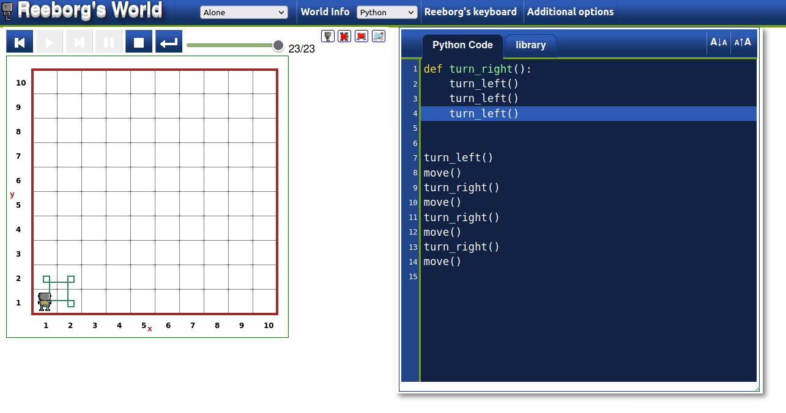
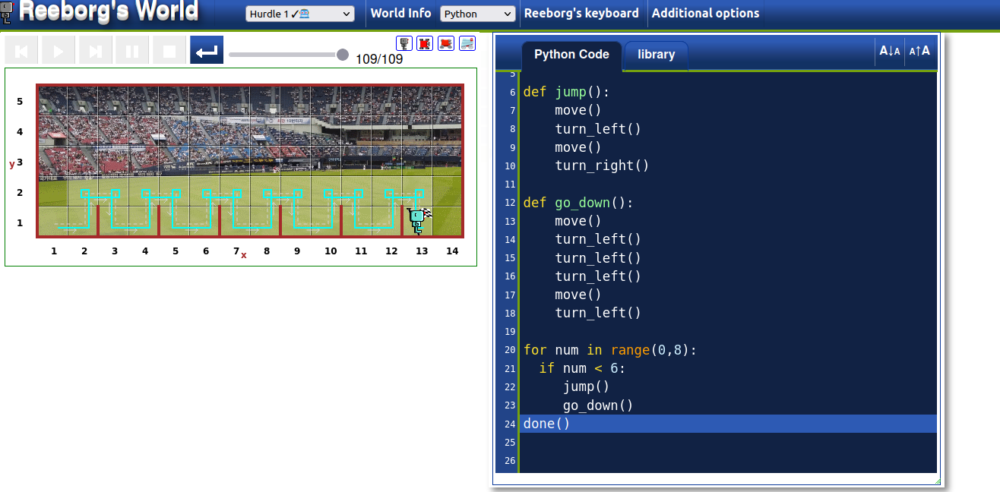

# Day6

## Lessons learned today

- Functions
```
def hello():
    print("Hello")
    print("Bye")
```
- while loops
```
num = 6
while num > 0:
    print("HI")
    num -= 1
```

- Code blocks

## Project to solidify material learned: 

### Reeborg's World

> This is an online game that helps you solidify the language you are learning currently it only has two languages js and py. I did some chalanges using what I learned today functions, while loops and code blocks.
for more information you can visit [Reeborg's world](http://reeborg.ca/reeborg.html?lang=en&mode=python&menu=worlds%2Fmenus%2Fchallenges_en.json&name=Alone&url=%2Fworlds%2Ftutorial_en%2Falone.json)

#### Preview:
- making a square:



- Hurdle


## How to run this on your device

- Clone this repository
```
git clone https://github.com/kingdreamerr/Day6_Reeborg-s_world.git
```
- cd into the repo
```
cd Day6_Reeborg-s_world
```

- Paste the following in the terminal 
```
python3 main.py
```